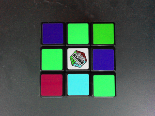

LabCore
===

基本ライブラリ(XIE.Core) に実装された機能のデモです。  

## ビルド

プロジェクトを起動してビルドするか、\_build.bat を実行してください。  

	C:> _build.bat

ビルド結果や実行結果を消去するには \_clean.bat を実行してください。  

	C:> _clean.bat

## 実行

コマンドプロンプトを起動し、$(TargetDir) に移動して実行してください。  
下図のように処理結果が表示されると正常です。

	C:> cd bin\Release  
	C:> demo.exe  
	test01              :     6.644 msec
	test02              :     7.642 msec
	test11              :    26.744 msec :  (000) RGB +- HSV +- RGB
	test11              :    20.742 msec :  (001) RGB +- HSV +- RGB
	test11              :    20.946 msec :  (002) RGB +- HSV +- RGB
	test11              :    20.520 msec :  (003) RGB +- HSV +- RGB
	test13
	array      len=12 model=S32(1)
	Data=
	10 11 12 13 20 21 22 23 30 31 32 33
	image      w,h=4,3 model=F32(1)Data=
	10.0 20.0 30.0 40.0
	10.1 20.1 30.1 40.1
	10.2 20.2 30.2 40.2
	matrix     r,c=3,4 model=F64(1)
	Data=
	10.0 20.0 30.0 40.0
	10.1 20.1 30.1 40.1
	10.2 20.2 30.2 40.2

また、処理結果画像が Results ディレクトリに保存されています。  

	$(TargetDir)
	├ demo.exe
	├ Results
	│├ (処理結果画像)

**test01: Filter の使用例（濃淡化）の処理結果画像**  

|元画像|出力画像|  
|------|--------|  
|||  

**test02: Filter の使用例（アフィン変換)の処理結果画像**  

|元画像|出力画像|  
|------|--------|  
|||  

**test11: Scanner の使用例（色空間変換）の処理結果画像**  

|元画像|色相(Hue)+60度|  
|------|--------|  
|||  

|色相(Hue)+120度|色相(Hue)+180度|  
|------|--------|  
|||  

## 構成

通常は依存する .NET アセンブリ (XIE.Core.dll) が GAC に登録されており、
それが依存する Win32 アセンブリが配置されたディレクトリが PATH 環境変数に設定されています。
.NET アセンブリが GAC に登録されていない場合はアプリケーションに隣接する位置に配置することで動作可能ですが、
Win32 アセンブリをバインドする為に PATH 環境変数の設定は必要です。
PATH 環境変数の設定については、このリポジトリの README.md をご参照ください。  

(1) 当アプリケーション  
(2) 依存する .NET アセンブリ  
(3) 依存する Win32 アセンブリ  

**64bit 環境**  

	XIE  
	├ bin  
	│├ xie_core_x64_100.dll … (3)  
	│├ xie_high_x64_100.dll … (3)  
	├ demo  
	│├ cli  
	││├ $(ProjectDir)  
	│││├ bin  
	││││├ Release        … $(TargetDir)
	│││││├ demo.exe      … (1)  
	│││││├ XIE.Core.dll  … (2)  

**32bit 環境**  

	XIE  
	├ bin  
	│├ xie_core_x86_100.dll … (3)  
	│├ xie_high_x86_100.dll … (3)  
	├ demo  
	│├ cli  
	││├ $(ProjectDir)  
	│││├ bin  
	││││├ Release        … $(TargetDir)
	│││││├ demo.exe      … (1)  
	│││││├ XIE.Core.dll  … (2)  
