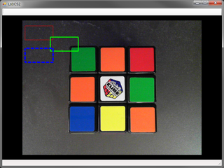

LabGDI
===

基本ライブラリ(XIE.Core) に実装された機能のデモです。  

このデモでは、表示機能を使用します。  

## ビルド

プロジェクトを起動してビルドするか、\_build.bat を実行してください。  

	C:> _build.bat

ビルド結果や実行結果を消去するには \_clean.bat を実行してください。  

	C:> _clean.bat

## 実行

$(TargetDir) に移動して demo.exe を実行してください。  
ウィンドウが起動し、画像とオーバレイ図形が表示されれば正常です。  

**表示結果**  

  

## 構成

通常は依存する .NET アセンブリ (XIE.Core.dll) が GAC に登録されており、
それが依存する Win32 アセンブリが配置されたディレクトリが PATH 環境変数に登録されています。
.NET アセンブリが GAC に登録されていない場合はアプリケーションに隣接する位置に配置することで動作可能ですが、
Win32 アセンブリをバインドする為に PATH 環境変数の登録は必須です。
PATH 環境変数の設定については、このリポジトリの README.md をご参照ください。  

(1) 当アプリケーション  
(2) 依存する .NET アセンブリ  
(3) 依存する Win32 アセンブリ  

**64bit 環境**  

	XIE  
	├ bin  
	│├ xie_core_x64_100.dll … (3)  
	│├ xie_high_x64_100.dll … (3)  
	├ demo  
	│├ cli  
	││├ $(ProjectDir)  
	│││├ bin  
	││││├ Release        … $(TargetDir)
	│││││├ demo.exe      … (1)  
	│││││├ XIE.Core.dll  … (2)  

**32bit 環境**  

	XIE  
	├ bin  
	│├ xie_core_x86_100.dll … (3)  
	│├ xie_high_x86_100.dll … (3)  
	├ demo  
	│├ cli  
	││├ $(ProjectDir)  
	│││├ bin  
	││││├ Release        … $(TargetDir)
	│││││├ demo.exe      … (1)  
	│││││├ XIE.Core.dll  … (2)  
