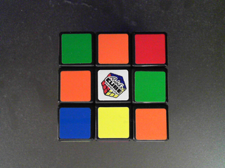
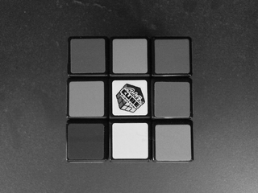
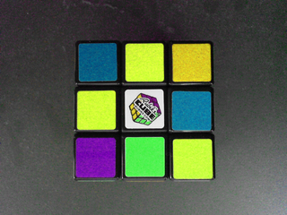
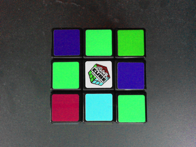
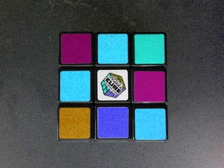

LabCore
===

基本ライブラリ(xie_core) に実装された機能のデモです。  

## ビルド

ターミナルを起動し、make を実行してください。  

	$ make

ビルド結果や実行結果を消去するには make clean を実行してください。  

	$ make clean

## 実行

ターミナルを起動し、demo を実行してください。  
下図のように処理結果が表示されると正常です。  

	$ ./demo
	test01              :     7.394 msec
	test02              :     7.810 msec
	test03              :    24.773 msec : (00) RGB +- HSV +- RGB
	test03              :    47.121 msec : (01) RGB +- HSV +- RGB
	test03              :    71.709 msec : (02) RGB +- HSV +- RGB
	test03              :    93.673 msec : (03) RGB +- HSV +- RGB

また、処理結果画像が Results ディレクトリに保存されています。  

	├ demo
	├ Results
	│├ (処理結果画像)

**test01: Filter の使用例（濃淡化）の処理結果画像**  

|元画像|出力画像|  
|------|--------|  
|||  

**test02: Filter の使用例（アフィン変換)の処理結果画像**  

|元画像|出力画像|  
|------|--------|  
|||  

**test03: Scanner の使用例（色空間変換）の処理結果画像**  

|元画像|色相(Hue)+60度|  
|------|--------|  
|||  

|色相(Hue)+120度|色相(Hue)+180度|  
|------|--------|  
|||  

## 構成

当アプリケーション が依存するシェアドオブジェクトをバインドする為に ldconfig が実行されている必要があります。  
ldconfig の方法については、このリポジトリの README.md をご参照ください。  

(1) 当アプリケーション  
(2) 依存するシェアドオブジェクト  

**環境**  

	XIE  
	├ demo  
	│├ gcc  
	││├ $(ProjectDir)  
	│││├ demo  … (1)  
	├ lib  
	│├ libxie_core.so … (2)  
	│├ libxie_high.so … (2)  

## デバッグ

デバッグを行う場合は下記のように引数を指定して make を実行してください。  

	$ make DEBUG=1

下記のように環境変数を設定してから make を実行しても構いません。  

	$ export DEBUG=1
	$ make

この場合、デバッグの解除を行うには環境変数を削除する必要があります。  

	$ unset DEBUG
	$ make

実行するには gdb を使用します。  

	$ gdb demo
