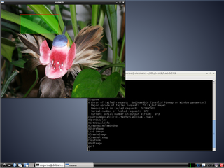

LabGDI
===

上位ライブラリ(xie_high) に実装された機能のデモです。  

このデモでは、表示機能を使用します。  

## ビルド

ターミナルを起動し、make を実行してください。

	$ make  

ビルド結果や実行結果を消去するには make clean を実行してください。  

	$ make clean

## 実行

ターミナルを起動し、demo を実行してください。  

	$ ./demo  

ウィンドウが起動し、画像とオーバレイ図形が表示されれば正常です。  
ENTER キーを押下すると終了します。  

**表示結果**  

  

## 構成

当アプリケーションが依存するシェアドオブジェクトをバインドする為に ldconfig が実行されている必要があります。  
ldconfig の方法については、このリポジトリの README.md をご参照ください。  

(1) 当アプリケーション  
(2) 依存するシェアドオブジェクト  
(3) libxie_high が依存する X11 及び OpenGL

**環境**  

	XIE  
	├ demo  
	│├ gcc  
	││├ $(ProjectDir)  
	│││├ demo  … (1)  
	├ lib  
	│├ libxie_core.so  … (2)  
	│├ libxie_high.so  … (2)  

	/
	├ usr
	│├ lib
	││├ i386-linux-gnu
	│││├ libX11.so.6    … (3)
	│││├ libGL.so.1     … (3)
	│││├ libGLU.so.1    … (3)
	│││├ libGLEW.so.1.7 … (3)

## デバッグ

デバッグを行う場合は下記のように引数を指定して make を実行してください。  

	$ make DEBUG=1

下記のように環境変数を設定してから make を実行しても構いません。  

	$ export DEBUG=1
	$ make

この場合、デバッグの解除を行うには環境変数を削除する必要があります。  

	$ unset DEBUG
	$ make

実行するには gdb を使用します。  

	$ gdb demo
