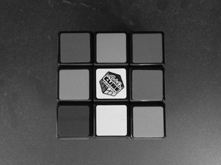

LabCore
===

基本ライブラリ(xie_core) に実装された機能のデモです。  

## ビルド

プロジェクトを起動してビルドするか、\_build.bat を実行してください。  

	C:> _build.bat

ビルド結果や実行結果を消去するには \_clean.bat を実行してください。  

	C:> _clean.bat

## 実行

コマンドプロンプトを起動し、$(TargetDir) に移動して実行してください。  
下図のように処理結果が表示されると正常です。

	C:> cd Win32\Release  
	C:> demo.exe  
	test01              :     5.581 msec
	test02              :     5.430 msec
	test03              :    15.916 msec : (00) RGB +- HSV +- RGB
	test03              :    13.475 msec : (01) RGB +- HSV +- RGB
	test03              :    13.786 msec : (02) RGB +- HSV +- RGB
	test03              :    13.461 msec : (03) RGB +- HSV +- RGB

また、処理結果画像が Results ディレクトリに保存されています。  

	$(TargetDir)
	├ demo.exe
	├ Results
	│├ (処理結果画像)

**test01: Filter の使用例（濃淡化）の処理結果画像**  

|元画像|出力画像|  
|------|--------|  
|||  

**test02: Filter の使用例（アフィン変換)の処理結果画像**  

|元画像|出力画像|  
|------|--------|  
|||  

**test03: Scanner の使用例（色空間変換）の処理結果画像**  

|元画像|色相(Hue)+60度|  
|------|--------|  
|||  

|色相(Hue)+120度|色相(Hue)+180度|  
|------|--------|  
|||  

## 構成

当アプリケーション が依存する Win32 アセンブリをバインドする為に PATH 環境変数が設定されている必要があります。
PATH 環境変数の設定については、このリポジトリの README.md をご参照ください。  

(1) 当アプリケーション  
(2) 依存する Win32 アセンブリ  

**32bit 環境**  

	XIE  
	├ bin  
	│├ xie_core_x86_100.dll … (2)  
	│├ xie_high_x86_100.dll … (2)  
	├ demo  
	│├ vc  
	││├ $(ProjectDir)  
	│││├ Win32  
	││││├ Release        … $(TargetDir)
	│││││├ demo.exe     … (1)  
