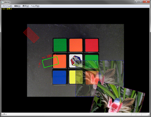

LabGDI
===

上位ライブラリ(xie_high) に実装された機能のデモです。  

このデモでは、表示機能を使用します。  

このプロジェクトをビルドするには下記のソフトウェアが必要です。  

- Visual Studio 2013 のマルチバイト MFC ライブラリ  
  [http://www.microsoft.com/ja-jp/download/details.aspx?id=40770](http://www.microsoft.com/ja-jp/download/details.aspx?id=40770)  

## ビルド

プロジェクトを起動してビルドするか、\_build.bat を実行してください。  

	C:> _build.bat

ビルド結果や実行結果を消去するには \_clean.bat を実行してください。  

	C:> _clean.bat

## 実行

$(TargetDir) に移動して demo.exe を実行してください。  
ウィンドウが起動し、画像とオーバレイ図形が表示されれば正常です。  

**表示結果**

  

## 構成

当アプリケーションが依存する Win32 アセンブリをバインドする為に PATH 環境変数が設定されている必要があります。
PATH 環境変数の設定については、このリポジトリの README.md をご参照ください。  

(1) 当アプリケーション  
(2) 依存する Win32 アセンブリ  

**32bit 環境**  

	XIE  
	├ bin  
	│├ xie_core_x86_100.dll … (2)  
	│├ xie_high_x86_100.dll … (2)  
	│├ xie_high_x86  
	├ demo  
	│├ vc  
	││├ $(ProjectDir)  
	│││├ Win32  
	││││├ Release        … $(TargetDir)
	│││││├ demo.exe     … (1)  
