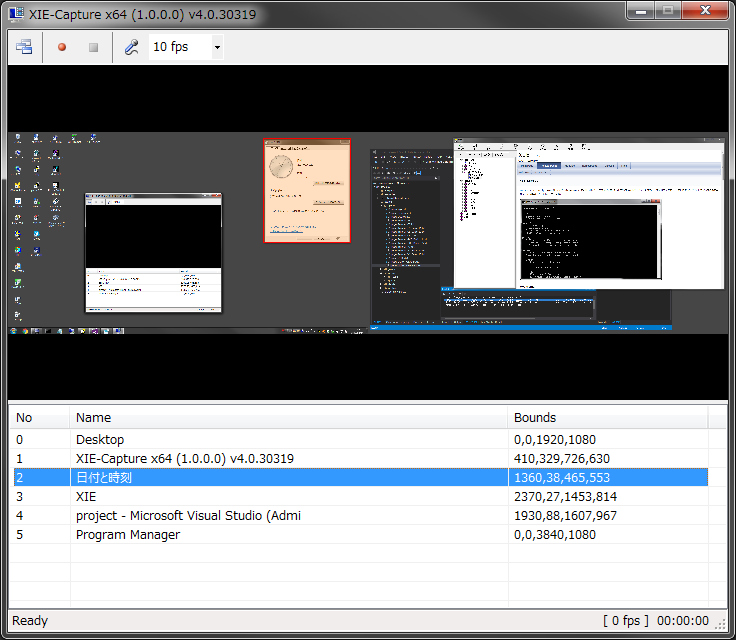
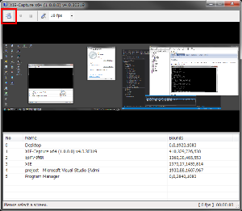
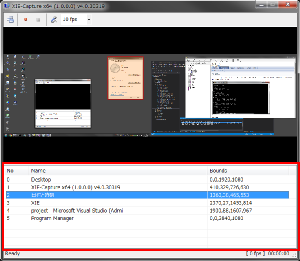
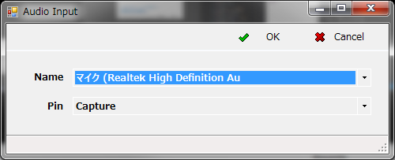

XIE-Capture
====

XIE-Capture (XIEcapture_100.exe) は、スクリーンの任意の位置（矩形範囲）をキャプチャして AVI 形式の動画に保存するユーティリティです。

## キャプチャの開始と停止:

キャプチャを開始するには、後述の "キャプチャ位置の選択" を先に行い、次に Start Capture を押下してください。  
キャプチャを停止するには、ツールバーの Stop Capture ボタンを押下してください。  

## キャプチャ位置の選択:

**表示**  
ツールバーの Refresh Screen List ボタン (下図の赤枠部分) を押下すると、
現在のデスクトップのプレビューとウィンドウ名称のリストを表示します。  

**選択**  
キャプチャする位置を選択するには ウィンドウ名称のリスト (下図の赤枠部分) の項目をクリックしてください。  

## オプション:

<b>フレームレートの選択:</b>  
ツールバーのコンボボックスからフレームレート (fps) を選択できます。  
選択肢は 1,5,10,15,30 の５種類です。  
既定では 10 fps です。  

<b>音声入力デバイスの選択:</b>  
ツールバーの Audio Input ボタンを押下すると下図のダイアログが表示され、音声入力デバイスを選択できます。  

## 動画ファイルの保存場所:

生成された動画ファイルは Documents ディレクトリ配下の XIE-Capture-1.0 ディレクトリに格納されています。  
既定では下記の位置にあります。  

	C:/
	|- Users
	|  |- (account)
	|  |  |- Documents
	|  |  |  |- XIE-Capture-1.0

ファイル名は下記の書式で自動生成されます。  

	ScreenCapture-YYYYMMDD_hhmmss.avi

※) YYYYMMDD は 年(西暦)、月、日 を示します。hhmmss は 時、分、秒 を示します。  
