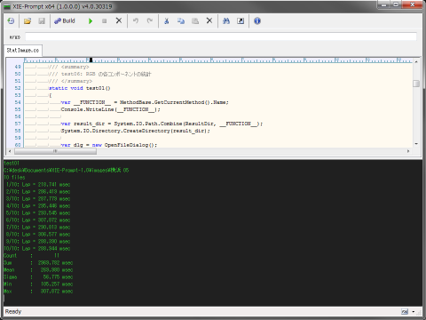

XIE-Prompt
====

XIE-Prompt (XIEprompt_100.exe) は、C# や Visual Basic で記述されたソースファイルを
スクリプトファイルのように実行するユーティリティです。
メモリ内でコンパイルして実行するので中間ファイルや実行ファイルは出力しません。

## ビルド:

ビルドを行うには予めソースコードを読み込んでおく必要があります。  
ツールバーの Build ボタンを押下すると現在読み込まれているソースコードのビルドを行います。  
ソースコードにエラーが無ければ実効可能状態になります。
エラーが有ればエラー箇所を表示します。

|実行可能状態|エラーが有る場合|
|------|------|
|||

## 実行:

ツールバーの Start ボタンを押下すると処理を実行します。  

実行中は Start ボタンが無効になり、Stop ボタンが有効になります。  
Stop ボタンを押下すると強制的に処理を中断します。  

|実行中|中断時|
|------|------|
|||

処理が完了すると再び実行可能状態になります。  

## バージョン表示:

ツールバーの Version ボタンを押下するとバージョン情報を出力します。  

