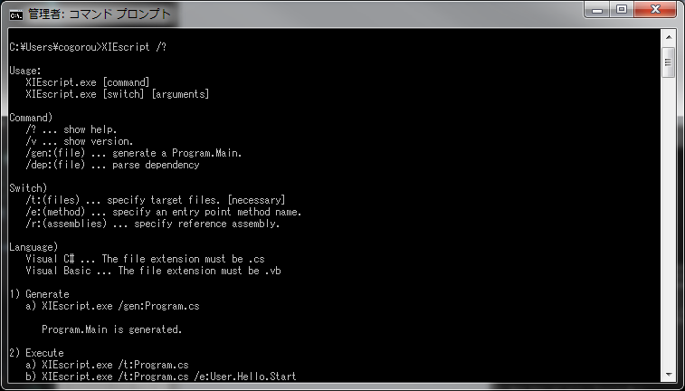
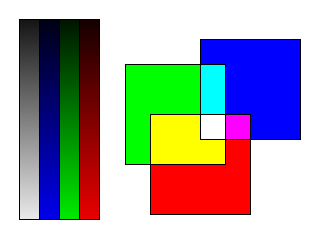
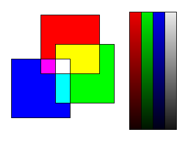
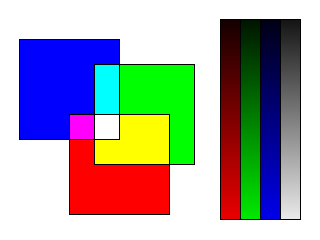

XIE-Script
====

XIE-Script (XIEscript_100.exe) は、C# や Visual Basic で記述されたソースファイルを
スクリプトファイルのように実行するユーティリティです。
メモリ内でコンパイルして実行するので中間ファイルや実行ファイルは出力しません。

## 使用方法の表示:

XIEscript_100.exe に引数 /? を指定して実行すると使用方法を出力します。  
引数を指定せずに実行した場合も同様です。  

	C:\Eggs\XIE-1.0\bin>XIEscript_100 /?

	Usage:
	   XIEscript_100.exe [command]
	   XIEscript_100.exe [switch] [arguments]

	Command)
	   /? ... show help.
	   /v ... show version.
	   /gen:(file) ... generate a Program.Main.
	   /dep:(file) ... parse dependency

	Switch)
	   /t:(files) ... specify target files. [necessary]
	   /e:(method) ... specify an entry point method name.
	   /r:(assemblies) ... specify reference assembly.

	Language)
	   Visual C# ... The file extension must be .cs
	   Visual Basic ... The file extension must be .vb

	1) Generate
	   a) XIEscript_100.exe /gen:Program.cs

	      Program.Main is generated.

	2) Execute
	   a) XIEscript_100.exe /t:Program.cs
	   b) XIEscript_100.exe /t:Program.cs /e:User.Hello.Start

	      The script is executed.
	      a : When has a Program.Main .
	      b : When does not have a Program.Main .

	3) Options
	   a) XIEscript_100.exe /t:Program.cs arg1 arg2 arg3
	   b) XIEscript_100.exe /t:Program.cs,Class1.cs,Class2.cs
	   c) XIEscript_100.exe /t:Program.cs /r:User1.dll,User2.dll

	      a : If you want to specify arguments.
	      b : If you want to specify more than one file.
	      c : If you want to specify reference assemblies.

## バージョン表示:

XIEscript_100.exe に引数 /v を指定して実行するとバージョン情報を出力します。  

	C:\Eggs\XIE-1.0\bin>XIEscript_100 /v
	[Application]
	FullName            : XIEscript_100, Version=1.0.0.0, Culture=neutral, PublicKeyToken=null
	FileName            : XIEscript_100.exe
	FileDescription     : XIE-Script
	Comments            : XIE-Script
	FileVersion         : 1.0.0.0
	ProductVersion      : 1.0.0.0
	ProductName         : XIE
	CompanyName         : Eggs Imaging Laboratory
	LegalCopyright      : Copyright c 2013 Eggs Imaging Laboratory
	LegalTrademarks     :
	Language            : ニュートラル言語

	[Environment]
	.NET Framework      : 4.0.30319.34209 (x64)
	OS                  : Microsoft Windows NT 6.1.7601 Service Pack 1
	Name                : Intel(R) Core(TM)2 Duo CPU     P8600  @ 2.40GHz
	Description         : Intel64 Family 6 Model 23 Stepping 6
	CurrentClockSpeed   : 2401
	MaxClockSpeed       : 2401
	NumberOfCores       : 2
	NumberOfLogicalProcessors: 2

## 生成:

XIEscript_100.exe に引数 /gen:(ファイル名) を指定して実行するとサンプルのソースファイルを生成します。  

生成方法)   

	C:\Eggs\XIE-1.0\bin>XIEscript_100 /gen:Program.cs

生成されたファイル)   

	namespace User
	{
		using System;
		using System.Collections.Generic;
		using System.Windows.Forms;
		using System.Reflection;

		static class Program
		{
			public static void Main(string[] args)
			{
				XIE.Axi.Setup();

				XIE.CxImage src = new XIE.CxImage();
				XIE.CxImage dst = new XIE.CxImage();

				try
				{
				}
				finally
				{
					src.Dispose();
					dst.Dispose();
				}
			}
		}
	}

## 実行:

XIEscript_100.exe に引数 /t:(ファイル名) を指定して実行するとソースファイルをコンパイルして実行します。  

実行方法)   

	C:\Eggs\XIE-1.0\bin>XIEscript_100 /t:Program.cs

コード例)   

	namespace User
	{
		using System;
		using System.Collections.Generic;
		using System.Windows.Forms;
		using System.Reflection;

		static class Program
		{
			public static void Main(string[] args)
			{
				XIE.Axi.Setup();

				XIE.CxImage src = new XIE.CxImage();
				XIE.CxImage dst = new XIE.CxImage();

				try
				{
					src.Load("color_grad.bmp");

					dst.Filter().Rotate(src, 2);
					dst.Save("color_grad-Rotate2.png");

					dst.Dispose();
					dst.Filter().Mirror(src, 2);
					dst.Save("color_grad-Mirror2.png");
				}
				finally
				{
					src.Dispose();
					dst.Dispose();
				}
			}
		}
	}
	

実行結果1) 回転(180度)   

|出力画像|←|入力画像|
|--------|--|--------|
||Rotate||

実行結果2) ミラー反転 (Y 方向)   

|出力画像|←|入力画像|
|--------|--|--------|
||Mirror||
