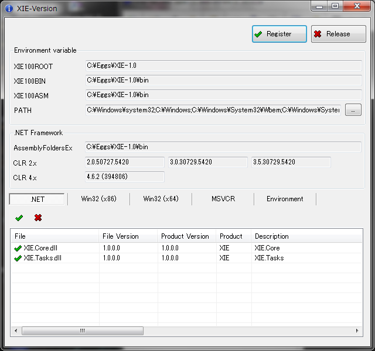
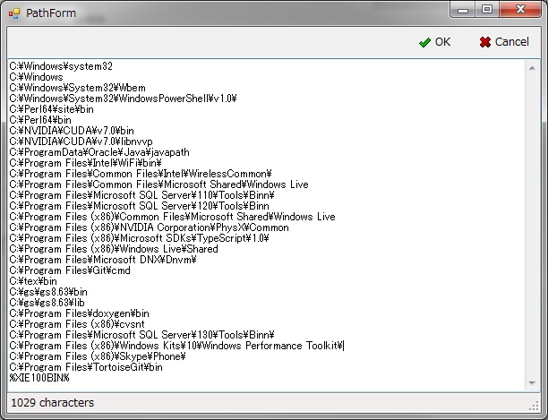

XIE-Version
====

XIE-Version (XIEversion_100.exe) は、アセンブリのバージョン情報の確認や環境設定を行うユーティリティです。   

## 参照または編集するレジストリ位置:

**環境変数**  
操作: 参照及び編集  
位置: HKLM/SYSTEM/CurrentControlSet/Control/Session Manager/Environment  

**AssemblyFoldersEx**  
操作: 参照及び編集  
位置:  

|O/S|キー|  
|---|----|  
|32bit|HKLM\SOFTWARE\Microsoft\.NETFramework\v4.0.30319\AssemblyFoldersEx\XIE 1.0|  
|64bit|HKLM\SOFTWARE\Wow6432Node\Microsoft\.NETFramework\v4.0.30319\AssemblyFoldersEx\XIE 1.0|  

**.NET Framework バージョン**  
操作: 参照のみ  
位置:  

|CLR|キー|  
|---|----|  
|2.x|HKLM/SOFTWARE/Microsoft/NET Framework Setup/NDP/v2.0.50727|  
||HKLM/SOFTWARE/Microsoft/NET Framework Setup/NDP/v3.0|  
||HKLM/SOFTWARE/Microsoft/NET Framework Setup/NDP/v3.5|  
|4.x|HKLM/SOFTWARE/Microsoft/NET Framework Setup/NDP/v4/Full|  

## Register ボタンと Release ボタン:

XIE のインストール位置を示す環境変数やレジストリ値を編集します。  
変更を反映するには、当ダイアログを終了後に エクスプローラ・コマンドプロンプト・Visual Studio の再起動が必要です。 

- Register ボタン  
	このボタンが押下されると以下の編集を行います。  
	- XIE100ROOT 環境変数を生成し、現在位置の１つ上のディレクトリを変数に書き込みます。
	- XIE100BIN 環境変数を生成し、現在位置を変数に書き込みます。
	- XIE100ASM 環境変数を生成し、現在位置を変数に書き込みます。
	- PATH 環境変数の最後尾に %XIE100BIN% を付加します。
	- AssemblyFoldersEx 配下にキー(XIE 1.0)を生成し、現在位置を書き込みます。
	- .NET アセンブリ(XIE.*.dll)の GAC 登録を試みます。

	コマンドライン引数(/i)を指定して実行した場合と等価です。  

		XIEversion_100.exe /i 

- Release ボタン  
	このボタンが押下されると以下の編集を行います。  
	- AssemblyFoldersEx 配下のキー(XIE 1.0)を削除します。
	- .NET アセンブリ(XIE.*.dll)の GAC 登録を解除します。

	コマンドライン引数(/u)を指定して実行した場合は上記に加え環境変数の削除も行います。  

		XIEversion_100.exe /u  

## Environment variable グループ:

|項目|値|種類|
|----|--|----|
|XIE100ROOT|C:/Eggs/XIE-1.0|REG_SZ|
|XIE100BIN|C:/Eggs/XIE-1.0/bin|REG_SZ|
|XIE100ASM|C:/Eggs/XIE-1.0/bin|REG_SZ|
|PATH|(既存の値);%XIE100BIN%;|REG_EXPAND_SZ|

- XIE100ROOT  
	XIE がインストールされているディレクトリの最上位を示します。  
	この環境変数は、主に Visual C++ で開発する場合に使用します。
	Visual Studio のプロジェクトのプロパティからは $(XIE100ROOT) という形式で使用できます。
	例えば、インクルードファイルへのパスを示すには $(XIE100ROOT)/include; のように記述します。
	バッチファイル等から参照する場合は %XIE100ROOT% という形式で使用できます。  

- XIE100BIN  
	XIE のライブラリがインストールされているディレクトリを示します。  
	この環境変数が PATH 環境変数に設定されています。
	また、Visual C++ で開発する場合にも使用します。
	Visual Studio のプロジェクトのプロパティからは $(XIE100BIN) という形式で使用できます。
	例えば、インポートライブラリへのパスを示すには $(XIE100BIN); のように記述します。
	バッチファイル等から参照する場合は %XIE100BIN% という形式で使用できます。  

- XIE100ASM  
	XIE の .NET アセンブリがインストールされているディレクトリを示します。  
	通常は、前述の XIE100BIN と同じ位置を示しています。
	この環境変数は、主に .NET Framework アプリケーション開発で使用します。
	Visual Studio のプロジェクトのプロパティからは $(XIE100ASM) という形式で使用できます。
	例えば、アセンブリ(XIE.Core.dll)の位置を参照には $(XIE100ASM)/XIE.Core.dll のように記述します。
	バッチファイル等から参照する場合は %XIE100ASM% という形式で使用できます。  

- PATH  
	PATH 環境変数の値を表示または編集します。  
	前述の [Register] ボタンが押下されると、この値の最後尾に %XIE100BIN%; が追加されます。
	右側の [...] ボタンを押下すると編集画面(下図)が表示されますので手動で編集することも可能です。  

	図) PATH 環境変数の編集画面  
	

	※注1) PATH 環境変数の編集を誤ると O/S が正常に動作しなくなりますので充分注意してください。  
	※注2) PATH 環境変数の値が上限数(約 2,000 文字)を超えた部分は認識されません。  
	※注3) PATH 環境変数の種類が REG_EXPAND_SZ でない場合、%XIE100BIN% が展開されず認識されません。  

## .NET Framework グループ:

.NET Framework 関連の情報を表示する覧です。  

|項目|値|
|----|--|
|AssemblyFoldersEx|C:/Eggs/XIE-1.0/bin|
|CLR 2.x|2.0.50727.xxx|
|       |3.0.30729.xxx|
|       |3.5.30729.xxx|
|CLR 4.x|4.x.x (build)|

- AssemblyFoldersEx  
	XIE の .NET アセンブリが配置されている位置を示します。  
	この設定は Visual Studio の参照設定ダイアログに .NET アセンブリを表示する為のものです。  
	※) 現在のところ、本ライブラリを使用するアプリケーション開発では使用していません。  

- CLR 2.x  
	現在インストールされている CLR 2.x (.NET Framework 2.0/3.0/3.5) のバージョンを表示します。
	インストールされていなければ空欄になります。  
	バージョン番号の xxx の部分はリビジョンによって異なります。
	2 セグメント目(マイナーバージョン)と 3 セグメント目(ビルド番号)は環境によって異なる場合があります。  

- CLR 4.x  
	現在インストールされている CLR 4.x (.NET Framework 4.0 以降) の最新バージョン(上表に記載する値の何れか 1 つ)を表示します。
	インストールされていなければ空欄になります。
	バージョン番号の 3 セグメント目(ビルド番号)は環境によって異なる場合があります。  
	※) CLR 4.x のマイナーバージョンはインプレース更新されるので下位バージョンは表示されません。  
