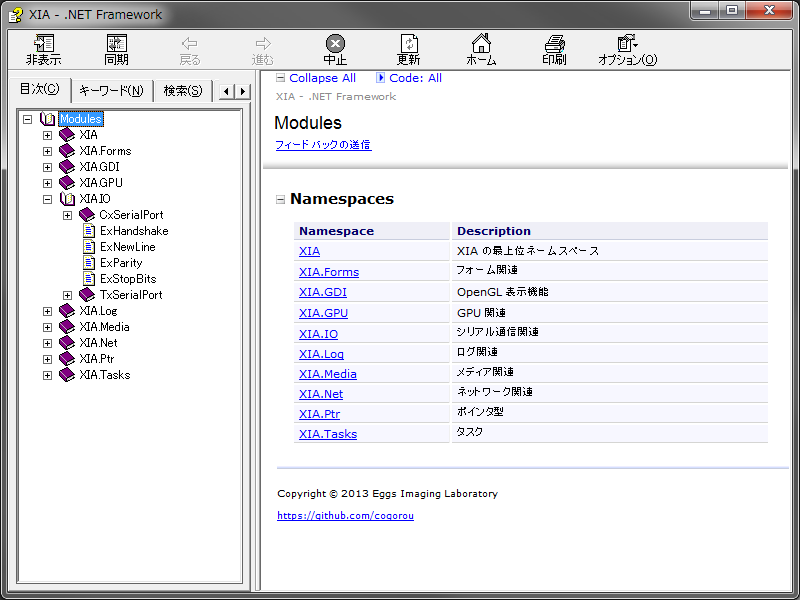
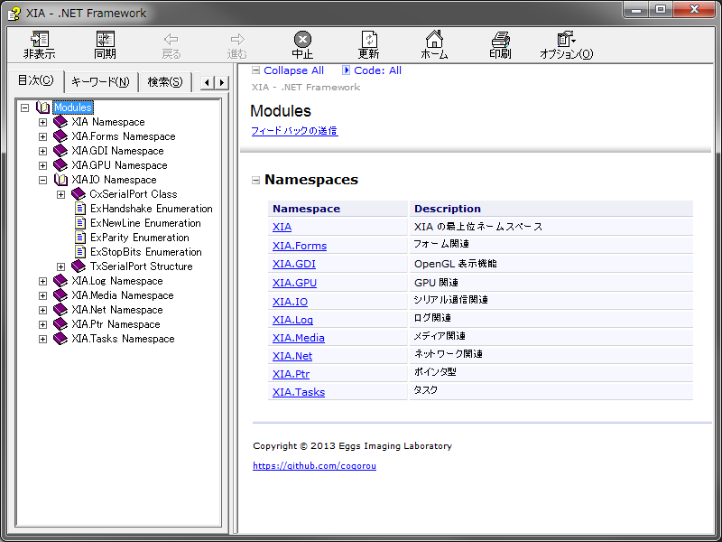

sandcastle-patch
===

Sandcastle で提供されるファイルを一部改変したものを集約しています。  
適用後にドキュメントを生成すると下図（左）のようにツリーノードが簡潔になります。

|修正後|修正前|  
|------|------|  
|||  

## 適用方法

(1) バージョンを確認してください。  

Sandcastle 2.7.4 を対象にしています。  
新旧に関わらず、バージョンが異なる場合は適用しないでください。  

(2) Sandcastle.zip の解凍  

何処か適当なディレクトリに解凍してください。

    C:\
    ├ temp
    │├ Sandcastle       … Sandcastle を一部改変したファイル群

(3) Sandcastle への上書き  

前述で解凍した Sandcastle ディレクトリを
オリジナルの Sandcastle ディレクトリに上書きしてください。

    (Drive Root)
    ├ Program Files (x86) … ※1
    │├ Sandcastle        … Sandcastle のファイル群
    ││├ Data
    ││├ Examples
    ││├ Extras
    ││├ Presentation         ┐ 変更される箇所
    │││└ vs2005              ┘
    ││├ ProductionTools
    ││├ ProductionTransforms ┐ 変更される箇所
    │││└ ja                  ┘
    ││├ Schemas
    ││├ Snippets
    ││├ License.txt
    ││└ SHFB.url

※1)  
64bit O/S での Sandcastle の既定のインストール先です。  
32bit O/S では Program Files が既定です。  
